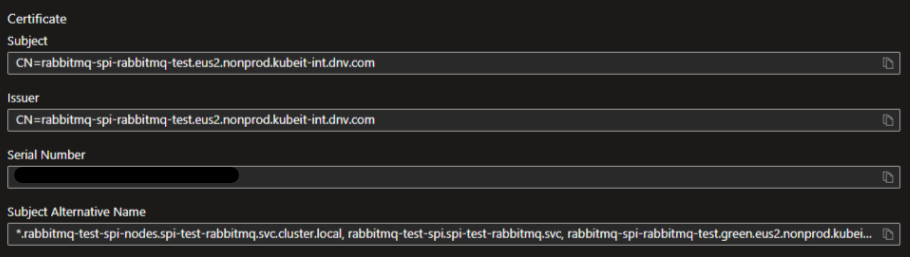

# kubeit-rabbitmq-chart

A Helm chart for deploying RabbitMQ in Kubernetes, customized for KubeIT environments.

## Table of Contents
- [Introduction](#introduction)
- [Features](#features)
- [External Secrets](#external-secrets)
- [Storage](#storage)
- [Workload Identity](#workload-identity)
- [Requirements](#requirements)
- [Installation](#installation)
- [Configuration](#configuration)
- [Values](#values)
- [Contributing](#contributing)
- [License](#license)

## Introduction

This Helm chart deploys a RabbitMQ cluster in Kubernetes. It supports advanced configurations such as persistent storage, custom user management, and integration with Azure Key Vault for secrets management. The chart is designed to work seamlessly with KubeIT environments.

## Features

- Deploy RabbitMQ with customizable replicas and resource limits.
- Support for persistent storage using Azure File Share or AKS built-in storage classes.
- Configurable RabbitMQ queues, users, and permissions.
- Integration with Azure Key Vault for secrets management.
- Optional creation of Kubernetes Service Accounts and Virtual Services.
- Environment-specific configurations for interal DNS and cluster settings.

## External Secrets

The Helm chart creates external secrets pulled down from tenant's Azure Key Vault. If tenant is configuring RabbitMQ using external Azure Storage Account it will create an External Secret with Storage Account credentials. And by default it will create admin user credentials. Tenants must create these secrets in KeyVault matching `azureSecretName`: `rabbitmq-admin-user` and `rabbitmq-admin-pass`

## Storage

RabbitMQ persists its data (the Mnesia database) to an Azure File Share. The chart attaches that share using **static provisioning**: you (or Terraform) pre-create the storage account and file share, and the chart renders a `PersistentVolume` (plus a bound PVC that the RabbitMQ StatefulSet adopts) that references it directly.

Because the share is referenced — not auto-created — this works against a storage account in **any** subscription or resource group and gives tenants full ownership of the share. There is no dependency on the AKS cluster's own subscription.

### Static provisioning

You provide the storage account and file share; the chart creates a `PersistentVolume` referencing it directly. **No share is auto-created.**

```yaml
persistentVolume:
  external: true
  static:
    enabled: true                           # render the static PV + PVC (default)
    resourceGroup: <RG_OF_STORAGE_ACCOUNT>
    storageAccount: <STORAGE_ACCOUNT_NAME>
    shareName: <FILE_SHARE_NAME>
    volumeHandle: "<RG>#<STORAGE_ACCOUNT>#<FILE_SHARE_NAME>"   # must be unique in the cluster
    subscriptionID: ""                      # set ONLY if the account is in a different subscription
  capacity:
    storage: 2Gi
  accessModes:
    - ReadWriteMany
```

Important notes:

- The static fields live under **`persistentVolume.static.*`** — `resourceGroup`, `storageAccount`, `shareName`, `volumeHandle`, `subscriptionID`. Do **not** put them under `csi.*` or top-level `persistentVolume.storageAccount`; those keys are ignored and the PV will render empty.
- `volumeHandle` must be **globally unique** within the cluster. The common form is `<resourceGroup>#<storageAccount>#<shareName>`.
- For a **cross-subscription** account, set `static.subscriptionID` to the storage account's subscription.

  ```yaml
  # in the ArgoCD AppProject
  spec:
    clusterResourceWhitelist:
      - group: ""
        kind: PersistentVolume
  ```

### Workload Identity

The share can be **authenticated** use workload identity, no need to keep storage accountkey secret in Key Vault:

- **Workload Identity** (default) — the pod's federated token authenticates to the share; no key is stored. See the next section.

Instead of mounting the Azure File Share with a storage account key, the chart can use [Azure Workload Identity](https://learn.microsoft.com/en-us/azure/aks/workload-identity-overview) so the mount authenticates with a federated token. This removes the long-lived storage account key from the cluster and is the recommended approach when the AKS cluster has the OIDC issuer and workload identity enabled.

Workload Identity is **enabled by default** (`persistentVolume.workloadIdentity.enabled: true`).

### Two authentication flows

`workloadIdentity.enabled: true` supports two flows, selected by `mountWithWorkloadIdentityToken`:

| | **Account-key via WI** (`mountWithWorkloadIdentityToken: false`/unset) | **Token-only / keyless** (`mountWithWorkloadIdentityToken: true`) |
| --- | --- | --- |
| How the mount authenticates | Driver uses the WI token to call ARM, fetches the account **key**, mounts with it | Driver mounts with the WI token directly over **SMB OAuth** — no key is ever retrieved |
| Storage account key in cluster | No (fetched just-in-time, not stored) | No (never used) |
| Required storage **role** on the account | `Storage Account Contributor` (to list keys) | `Storage File Data Privileged Contributor` (or `Storage File Data SMB MI Admin`) |
| Extra storage account setting | `allowSharedKeyAccess: true` | **SMB OAuth must be enabled** |
| CSI driver version | any WI-capable version | **v1.35.0+** |

> The fully keyless **token-only** flow is the most secure. It is what the cross-subscription example below uses.

### Step-by-step setup (token-only flow)

This is the end-to-end setup, matching the order things must exist.

**1. Enable workload identity on the AKS cluster** (OIDC issuer + workload identity add-on). Note the OIDC issuer URL:
```bash
az aks show -g <CLUSTER_RG> -n <CLUSTER_NAME> --query oidcIssuerProfile.issuerUrl -o tsv
```

**2. Create a user-assigned managed identity** and note its `clientId`:
```bash
az identity create -g <MI_RG> -n <MI_NAME>
az identity show -g <MI_RG> -n <MI_NAME> --query clientId -o tsv
```

**3. Create a federated identity credential** linking the cluster OIDC issuer to the RabbitMQ service account. The subject must match the namespace and service account name **exactly**:
```bash
az identity federated-credential create \
  --identity-name <MI_NAME> -g <MI_RG> \
  --name rabbitmq-fic \
  --issuer "<OIDC_ISSUER_URL>" \
  --subject "system:serviceaccount:<NAMESPACE>:rabbitmq-sa" \
  --audience api://AzureADTokenExchange
```

**4. Enable SMB OAuth on the storage account** (required for the token-only Kerberos mount):
```bash
az storage account update -n <STORAGE_ACCOUNT> -g <STORAGE_RG> \
  --subscription <STORAGE_SUBSCRIPTION_ID> \
  --enable-smb-oauth true
```

**5. Assign the data-plane role** to the managed identity on the storage account. `Storage File Data Privileged Contributor` grants the identity full data-plane access to the file shares (bypassing share-level ACLs), which is what the keyless CSI mount needs:
```bash
az role assignment create \
  --assignee <MANAGED_IDENTITY_CLIENT_ID> \
  --role "Storage File Data Privileged Contributor" \
  --scope "/subscriptions/<STORAGE_SUBSCRIPTION_ID>/resourceGroups/<STORAGE_RG>/providers/Microsoft.Storage/storageAccounts/<STORAGE_ACCOUNT>"
```

**6. Configure the chart values:**
```yaml
serviceAccount:
  create: true
  name: rabbitmq-sa
  annotations:
    azure.workload.identity/client-id: <MANAGED_IDENTITY_CLIENT_ID>
    azure.workload.identity/tenant-id: <TENANT_ID>

persistentVolume:
  external: true
  static:
    enabled: true
    resourceGroup: <STORAGE_RG>
    storageAccount: <STORAGE_ACCOUNT>
    shareName: <FILE_SHARE_NAME>
    volumeHandle: "<STORAGE_RG>#<STORAGE_ACCOUNT>#<FILE_SHARE_NAME>"
    subscriptionID: <STORAGE_SUBSCRIPTION_ID>   # only if cross-subscription
  workloadIdentity:
    enabled: true
    clientID: <MANAGED_IDENTITY_CLIENT_ID>
    mountWithWorkloadIdentityToken: true
```

See [`examples/values-wi-token-static.yaml`](examples/values-wi-token-static.yaml) for a complete example.

> The managed identity that owns the federated credential, the `client-id` service account annotation, and the storage role assignment must all be the **same** identity.

### Troubleshooting

Mount errors surface on the RabbitMQ pod (`kubectl describe pod <pod> -n <ns>`). The table below maps the common errors to their cause and fix.

| Symptom | Cause | Fix |
| --- | --- | --- |
| `storageclass.storage.k8s.io "<name>" not found`, or PVC stuck `Pending` and never binds | Static fields were placed under the wrong keys, so the PV rendered empty/invalid and the PVC could not bind to it | Put the values under `persistentVolume.static.*`; ensure `static.enabled: true` and `volumeHandle`/`resourceGroup`/`storageAccount`/`shareName` are all set |
| `resource :PersistentVolume is not permitted in project <name>` (ArgoCD `SyncFailed`) | The ArgoCD `AppProject` doesn't allow the cluster-scoped `PersistentVolume` | Whitelist `PersistentVolume` in the project's `clusterResourceWhitelist` |
| `mount error(126): Required key not available` / `Error getting Kerberos service ticket` | Token-only mount: **SMB OAuth not enabled** on the storage account | `az storage account update ... --enable-smb-oauth true` |
| `mount error(13): Permission denied` (after Kerberos succeeds) | Identity authenticated but is **not authorized** — missing/insufficient data-plane role | Assign **`Storage File Data Privileged Contributor`** (or `Storage File Data SMB MI Admin`) to the managed identity on the storage account; wait for RBAC to propagate, then delete the pod to retry |
| `Failed to perform 'write' on resource(s) of type 'storageAccounts/fileServices'` | Managed identity authenticates but lacks permission on the file service | Same as above — **`Storage File Data Privileged Contributor`**; confirm SMB OAuth and that the role, federated credential, and SA annotation all use the **same** identity |

## Requirements

- Kubernetes 1.21+
- Helm 3.0+
- Azure Key Vault (for secrets management)
- Azure CSI Driver (if using Azure File Share for persistent storage or in built storage classes)
- Azure CSI Driver (if using Azure File Share for persistent storage or in built storage classes)


## Installation

1. Add the Helm repository (if applicable):
   ```bash
   helm repo add kubeit https://example.com/helm-charts
   helm repo update

2. ArgoCD application
    ```bash
      project: tenant2
      source:
         repoURL: https://github.com/dnv-gssit/kubeit-charts.git
         path: charts/kubeit-rabbitmq-chart
         targetRevision: feature/rabbitmq-chart
      helm:
         values: |
            env: dev
            region: westeurope
            dnsDomain: "kubeit.dnv.com"
            internalDnsDomain: "kubeit-int.dnv.com"
            clusterSubdomain: "dev001"
            clusterColour: "blue"
            ingressType: "internal"
            shortRegion: we
            tenantName: tenant2
            targetRevision: feature/rabbitmq-chart
            repoURL: https://github.com/dnv-gssit/kubeit-charts.git
            networkPlugin: azure
            tenantMultiRegion: true
            managementNamespace: "management-tenant2"
      destination:
      server: https://kubernetes.default.svc
      namespace: standard
      syncPolicy:
      automated:
         prune: true
         selfHeal: true
      syncOptions:
         - Validate=true
         - CreateNamespace=false
         - PrunePropagationPolicy=foreground
         - PruneLast=false
      retry:
         limit: 2
         backoff:
            duration: 5s
            factor: 2
            maxDuration: 1m

## TLS Cert

Create a TLS cert on Azure Key vault to encrypt traffic between client and RabbitMQ cluster.


It must be in PEM format
The certificate's SAN:

```
- *.rabbitmq-test-spi-nodes.spi-test-rabbitmq.svc.cluster.local
- rabbitmq-test-spi.spi-test-rabbitmq.svc
- rabbitmq-spi-rabbitmq-test.green.eus2.nonprod.kubeit-int.dnv.com
- rabbitmq-spi-rabbitmq-test.eus2.nonprod.kubeit-int.dnv.com
...
```
The Subject should be `CN=<host-of-rabbitmq-cluster>` For example. `CN=<NameofRMQCluster>.<colour>.<region>.kubeit-int.dnv.com`
Ref: https://www.rabbitmq.com/kubernetes/operator/using-operator#one-way-tls


One way TLS settings on RabbitMQ Cluster ensures that client does not require certs. Ensure these settings are enabled:


```
ssl_options.fail_if_no_peer_cert = false
ssl_options.verify = verify_none
```


## Rabbitmq Default User Credentials

When trying to store the default user credentials in Azure KV. KV does not support multi-line secret directly from portal.
You must store the secret contents in a .txt file like this:

secretfile.txt
```
default_user=admin
default_pass=admin
```

Create the secret via Azure CLI:
```
az keyvault secret set --vault-name "<your-keyvault-name>" --name "default-test-user-creds" --file "secretfile.txt"
```
